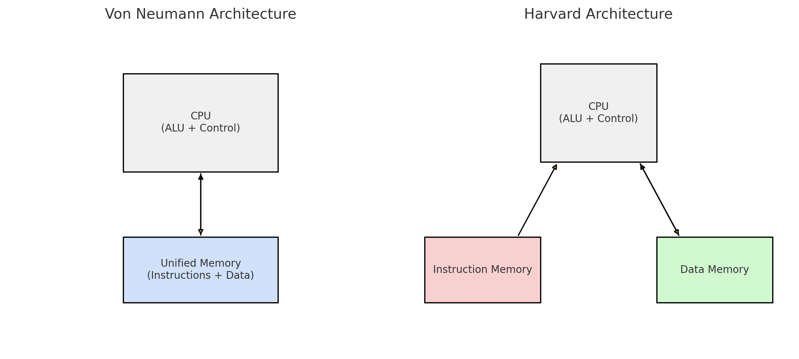

# Week 1

## Computer Architecture

**Computer Architecture**: The study of how to design the parts of a computer 
system visible to programmers, including the instruction set, memory hierarchy,
and execution model (e.g., pipelined execution).

**Computer organization**: Focuses on the internal structure of hardware 
components like ALUs, registers, and buses.

In practice, both used interchangably.

Studying computer architecture helps us understand:

 - code implementation,
 - performance optimization,
 - concepts such as parallelism, caching, and pipelining,
 - tradeoffs between hardware and software design choices

## Computers and Programs

A computer *executes* given *instructions (programs)* to produce *results* for 
the user.

### Program Execution
In general, when it comes to **executing** a given program, there are two methods:

1. **Translation** (compilation)
    - Converts a high-level program into a low-level (machine code) version 
    before execution
2. **Interpretation**
    - A low-level machine program (the interpreter) reads and executes 
    high-level programs instruction by instruction during runtime. 

### Program Languages and Levels

A **program** is a set of instructions written in a high level programming language.

1. **Machine Language (low level)**
     Raw binary code (zeros and ones) executed directly by the CPU.  

2. **Human-Readable Machine Language**
     Uses mnemonics instead of binary, but still closely tied to hardware. 
     Each instruction maps directly to machine code.  Example: **Assembly (1949)**

3. **"Modern" Programming Languages (high level)**
     Abstract, human-readable languages designed to be portable and easier to write.
     Compiled or interpreted into lower-level code.  Examples:  **C (1970), 
Java (1995), Python (1991), JavaScript (1995)** 

#### Multilevel Machines

0. **Digital Logic Level**  
   - Built from basic logic gates (**AND, OR, NOT**).  
   - These gates form circuits that make up components like CPU and memory.  

1. **Microarchitecture Level**  
   - Executes instructions using hardware components: **ALU, registers, microprograms, memory**.  
   - A **microprogram** controls how instructions are executed.  
   - Represents the actual organization of the CPU at the circuit level.  

2. **Instruction Set Architecture (ISA) Level**  
   - Defines the set of machine instructions available (e.g., `LOAD`, `ADD`, `STORE`).  
   - Independent of how the CPU actually implements them.  
   - **Analogy:** Like a **menu** in a restaurant — lists the “dishes” (operations) you can order, but not how they’re cooked.  

3. **Operating System Machine Level**  
   - Main duties: **memory management, process execution, and system resource protection**.  
   - Provides abstraction to simplify programming.  
   - Assembly instructions generally pass through this level unchanged.  
   - Some interpretation happens here, as the OS manages low-level execution details.  

4. **Assembly Language Level**  
   - Human-readable mnemonics (e.g., `MOV`, `ADD`).  
   - Harder to use — even simple programs require many lines.  
   - Translated into machine code by an **assembler**.  

5. **Problem-Oriented Language Level (High-Level Languages)**  
   - Includes languages like **C, Java, Python**.  
   - Easier for humans to read, write, and maintain.  
   - Compilers or interpreters convert these programs into assembly/machine code.  

### Hardware vs Software and Control Units

Anything that can be done with software can also be done with hardware, and
vice versa (functionality).

Hardware is generally *faster* and *more expensive*.

#### Control Unit: Microprogrammed vs Hardwired

The **Control Unit (CU)** generates the control signals that tell the CPU’s datapath (ALU, registers, memory, etc.) what to do when executing instructions.

---

##### Microprogrammed Control Unit
- **Software-based control**: Control signals are stored in a special memory (control memory, often ROM).  
- A **microprogram** is a sequence of microinstructions that generate the necessary control signals.  
- Execution = fetching and running these microinstructions in sequence.  
- **Advantages:**
  - Easy to modify or extend (new instructions can be added by changing the microprogram).  
  - Flexible and easier to design.  
- **Disadvantages:**
  - Slower than hardwired control, since every instruction is broken into microinstructions that must be fetched and interpreted.  

**Example (slides):**
- Microprogram (P1): LEDs moving to the right.  
- Microprogram (P2): LEDs moving to the left.  
- Stored in ROM, and switching the program changes the behavior.

---

##### Hardwired Control Unit
- **Hardware-based control**: Control signals are generated directly by fixed logic circuits.  
- No control memory — logic gates are wired to decode the opcode and trigger control signals.  
- **Advantages:**
  - Much faster (signals generated directly by circuits).  
- **Disadvantages:**
  - Inflexible — changing the instruction set requires redesigning the hardware.  
  - More complex design as instruction sets grow.  

---

##### Comparison Table

| Aspect            | Microprogrammed CU                   | Hardwired CU                  |
|-------------------|---------------------------------------|-------------------------------|
| Implementation    | Control memory + microinstructions   | Fixed logic circuits          |
| Flexibility       | Easy to modify, new instructions easy | Difficult to change           |
| Speed             | Slower (extra step: microinstruction)| Faster (direct hardware)      |
| Complexity        | Simpler design                       | More complex for large ISAs   |

---

##### Historical Context
- **Early computers**: Direct hardwired execution.  
- **Mid-generation**: Microprogramming introduced to simplify control of complex instruction sets.  
- **Modern trend**: Moving back toward hardwired (or simplified ISAs) because microprogramming slows down execution.  

### Computer Architecture

#### Computer Generations

 - Zeroth Generation (1642 – 1945): Mechanical Computers (e.g., Pascal's calculator).
 - First Generation (1945 – 1955): Vacuum Tubes (e.g., ENIAC – large, 
 power-hungry, first electronic general-purpose computer). * Von Neumann 
 Architecture (1945): Both data and program stored in memory (still the basis 
 for most digital computers).
 - Second Generation (1955 – 1965): Transistors (e.g., IBM 7094, PDP-8 with a 
 single bus/omnibus). Smaller, faster, cheaper.
 - Third Generation (1965 – 1980): Integrated Circuits (IC) (e.g., IBM 360).
 Dozens of transistors on a single chip, leading to even smaller, faster, and cheaper computers.
 - Fourth Generation (1980 – ?): Very Large Scale Integration (VLSI) (e.g., 
 Intel CPUs). Millions of transistors on a single chip.

#### Moore's Law
- Gordon Moore (Intel, 1965).  
- Transistors on a chip roughly double every ~2 years.  
- Result: smaller, faster, cheaper computers.  
- Recently slowing due to physical limits.

#### Harvard vs. Von Neumann Architecture
 -  Harvard Architecture: 
    - Separate memory for data and code.
    - Two separate data paths for instructions and data. 
    - Faster (can access instructions and data simultaneously). 
    - Used in microcontrollers, DSPs. 
    - More complex design.
 -  Von Neumann Architecture: 
    - Shared memory for data and code. 
    - One shared data path for both. 
    - Slower (one access at a time). 
    - Used in general-purpose computers (PCs, laptops). 
    - Simpler design.

### Instruction Set Architectures (ISAs)

An **Instruction Set Architecture (ISA)** defines the set of instructions that a CPU can execute. Different families of processors use different ISAs, optimized for different purposes.

#### x86 Architecture
  - Originated with Intel 8086 (1978).
  - Complex Instruction Set Computer (**CISC**) – many specialized instructions.
  - Dominant in personal computers and servers.
  - High backward compatibility (can still run very old code).
  - Large, complex instruction set with advanced microarchitectural optimizations.

#### ARM Architecture
  - First appeared in Acorn Archimedes (1987), later spun off as ARM Holdings.
  - Reduced Instruction Set Computer (**RISC**) – small, simple set of instructions.
  - Used in mobile devices, tablets, embedded systems, and increasingly laptops and servers (e.g., Apple M1/M2, AWS Graviton).
  - High performance per watt (very energy efficient).
  - Scales from tiny microcontrollers to high-end processors.

#### AVR Architecture
  - Developed in 1996 (Norwegian Institute of Technology, later Atmel).
  - RISC-based 8-bit microcontroller ISA.
  - Widely used in embedded systems and Arduino boards.
  - Small, low-power, inexpensive.
  - Integrates Flash, EEPROM, and RAM on the same chip.

---

#### Comparison Table

| Feature            | x86 (CISC)                  | ARM (RISC)                       | AVR (RISC)                |
|--------------------|-----------------------------|----------------------------------|---------------------------|
| First Release      | 1978 (Intel 8086)           | 1987 (Acorn Archimedes)          | 1996 (Atmel)              |
| Instruction Set    | Large, complex              | Small, simple                    | Small, simple (8-bit)     |
| Main Usage         | PCs, laptops, servers       | Mobile, tablets, servers, IoT    | Embedded, Arduino         |
| Efficiency         | High performance, less efficient per watt | Very energy efficient         | Extremely low power       |
| Cost/Scale         | Expensive, high complexity  | Scales across many devices       | Low cost, hobbyist friendly |

